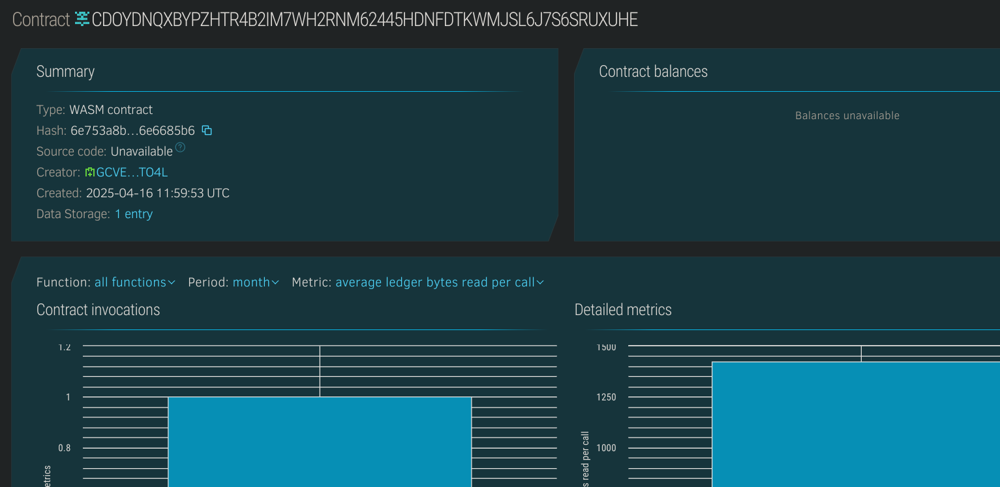

# NFT Collection Viewer

## 📌 Project Title
**NFT Collection Viewer**

---

## 📄 Project Description
NFT Collection Viewer is a lightweight smart contract built on the Stellar Soroban platform that allows users to view and manage their personal NFT collections. It provides a simple interface for adding and retrieving NFTs owned by individual users.

---

## 🎯 Project Vision
The goal of this contract is to empower developers and creators to build NFT-based applications with easy integration of NFT ownership tracking and collection browsing. This contract aims to simplify the viewing layer of NFTs for users without complex marketplace features.

---

## 🚀 Key Features
- 🖼️ Store NFT details such as name, description, and image URL
- 👤 Associate NFTs with specific owner addresses
- 🔍 Retrieve all NFTs belonging to a user
- ⚡ Lightweight and fast contract optimized for read/view operations

---

## 🔮 Future Scope
- 🏷️ Add metadata standards (e.g., token_id, royalties, etc.)
- 🌐 Support filtering and pagination of NFTs
- 🔗 Integrate with off-chain gallery viewer or dApps
- 🛡️ Add access control for authorized NFT minting or editing

## Contract Details
CDOYDNQXBYPZHTR4B2IM7WH2RNM62445HDNFDTKWMJSL6J7S6SRUXUHE

